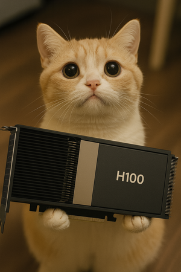

# canhazgpu

***A GPU reservation tool for single host shared development systems***



In shared development environments with multiple GPUs, researchers and developers often face conflicts when trying to use GPUs simultaneously, leading to out-of-memory errors, failed training runs, and wasted time debugging resource conflicts. This utility provides a simple reservation system that coordinates GPU access across multiple users and processes on a single machine.

### Who this is for

You peacefully share a host but want a helper to avoid accidental conflicts.

- You have a single host with GPUs (NVIDIA or AMD) shared by multiple users
- You all log in and run commands manually for development and/or testing
- You can still talk to each other about playing nice and sharing your (GPU) toys

### Who this is NOT for

If your needs are more than this, you probably want something more powerful like Kubernetes.

- You want to manage resources across a cluster
- You want to set resource usage limits or other policies
- You want to support workload priorities and preemption

## Quick Start

```bash
# Start Redis server listening on localhost:6379
# This is the default configuration in most cases.

# Initialize GPU pool
canhazgpu admin --gpus 8

# Check current status
canhazgpu status

# Run vLLM with an automatic 2 GPU reservation.
# - CUDA_VISIBLE_DEVICES is set in the environment before running the command.
# - If GPUs are unavailable, waits in queue until they become available.
canhazgpu run --gpus 2 -- vllm serve my/model --tensor-parallel-size 2

# Reserve specific GPUs by ID (waits if unavailable)
canhazgpu run --gpu-ids 1,3 -- python train.py

# Fail immediately if GPUs unavailable (no queueing)
canhazgpu run --nonblock --gpus 2 -- python train.py

# Wait up to 30 minutes for GPUs, then fail
canhazgpu run --wait 30m --gpus 4 -- python train.py

# Run interactive programs (full TTY support)
canhazgpu run --gpus 1 -- python  # Interactive Python REPL
canhazgpu run --gpus 1 -- codex   # Interactive coding assistant

# Check the reservation queue
canhazgpu queue

# Reserve a single GPU manually for development
canhazgpu reserve --gpus 1 --duration 4h

# Reserve specific GPU IDs manually
canhazgpu reserve --gpu-ids 0,2 --duration 2h

# Reserve GPUs and set CUDA_VISIBLE_DEVICES in one step (for scripting)
export CUDA_VISIBLE_DEVICES=$(canhazgpu reserve --gpus 2 --short)

# Release manual reservations when done
canhazgpu release

# Generate reservation reports
canhazgpu report --days 7

# Start web dashboard
canhazgpu web --port 8080
```

## Key Features

- **Interactive program support**: Full TTY support for interactive programs like Python REPL, codex, vim
- **Fair queueing**: FCFS queue ensures fair access when GPUs are busy - requests wait automatically
- **Race condition protection**: Uses Redis-based distributed locking
- **Automatic cleanup**: GPUs auto-released when processes end or reservations expire
- **MRU-per-user allocation**: Smart GPU affinity using most recently used per-user strategy with LRU fallback
- **Specific GPU reservation**: Reserve exact GPU IDs when needed (e.g., --gpu-ids 1,3)
- **Unreserved usage detection**: Identifies GPUs in use without proper reservations
- **Real-time validation**: Uses nvidia-smi or amd-smi to verify actual GPU usage
- **Multi-provider support**: Supports both NVIDIA and AMD GPUs with automatic detection
- **Flexible reservations**: Support for both command execution and manual reservations
- **Reservation reporting**: Track and analyze GPU reservation patterns over time by user
- **Web dashboard**: Real-time monitoring interface with status and reservation reports

## Web Dashboard


The web dashboard provides:
- Real-time GPU status monitoring with automatic refresh
- Queue status with wait times and allocation progress
- Interactive reservation reports with customizable time periods
- Visual status indicators and usage visualization
- Quick access to documentation and source code

Start the dashboard with `canhazgpu web` and access it at http://localhost:8080

## Documentation

For detailed usage, configuration, and administration:

**📚 [Full Documentation](http://blog.russellbryant.net/canhazgpu/)**

- **[Installation Guide](http://blog.russellbryant.net/canhazgpu/installation/)** - Setup and dependencies
- **[Quick Start](http://blog.russellbryant.net/canhazgpu/quickstart/)** - Get up and running
- **[Usage Guide](http://blog.russellbryant.net/canhazgpu/usage-run/)** - Detailed command examples
- **[Configuration](http://blog.russellbryant.net/canhazgpu/configuration/)** - Configuration options and settings
- **[Troubleshooting](http://blog.russellbryant.net/canhazgpu/admin-troubleshooting/)** - Common issues and solutions

## Requirements

- **Go 1.23+** (for building from source)
- **Redis server** running on localhost:6379
- **GPUs** with appropriate management tools:
  - **NVIDIA GPUs**: nvidia-smi available
  - **AMD GPUs**: amd-smi available (ROCm 5.7+)
- **System access** to `/proc` filesystem or `ps` command

## Installation

```bash
# Option 1: Install directly from GitHub (recommended)
go install github.com/russellb/canhazgpu@latest

# Option 2: Build from source
git clone https://github.com/russellb/canhazgpu.git
cd canhazgpu
make install

# Option 3: Download pre-built binary (when available)
wget https://github.com/russellb/canhazgpu/releases/latest/download/canhazgpu
chmod +x canhazgpu
sudo cp canhazgpu /usr/local/bin/

# Install bash completion (optional but recommended)
wget https://raw.githubusercontent.com/russellb/canhazgpu/main/autocomplete_canhazgpu.sh
sudo cp autocomplete_canhazgpu.sh /etc/bash_completion.d/

# Optional: Create short alias symlink (after installing to /usr/local/bin)
sudo ln -s /usr/local/bin/canhazgpu /usr/local/bin/chg

# Initialize GPU pool (auto-detects GPU provider)
canhazgpu admin --gpus $(nvidia-smi -L | wc -l)  # For NVIDIA
# OR
canhazgpu admin --gpus $(amd-smi list --json | jq 'length')  # For AMD

# Initialize with specific provider (optional)
canhazgpu admin --gpus 8 --provider nvidia
canhazgpu admin --gpus 8 --provider amd
```

## How It Works

1. **Validation**: Uses nvidia-smi or amd-smi to detect actual GPU usage and identify conflicts
2. **Coordination**: Uses Redis for distributed state management and race condition prevention
3. **Queueing**: FCFS (First Come First Served) queue with greedy partial allocation for the first waiter
4. **Allocation**: MRU-per-user (Most Recently Used per user) strategy provides GPU affinity with LRU fallback for fair distribution
5. **Monitoring**: Heartbeat system tracks active reservations and handles cleanup
6. **Enforcement**: Automatically excludes unreserved GPU usage from allocation

## Contributing

See the [Contributing Guide](http://blog.russellbryant.net/canhazgpu/dev-contributing/) for development setup, coding standards, and how to submit contributions.
