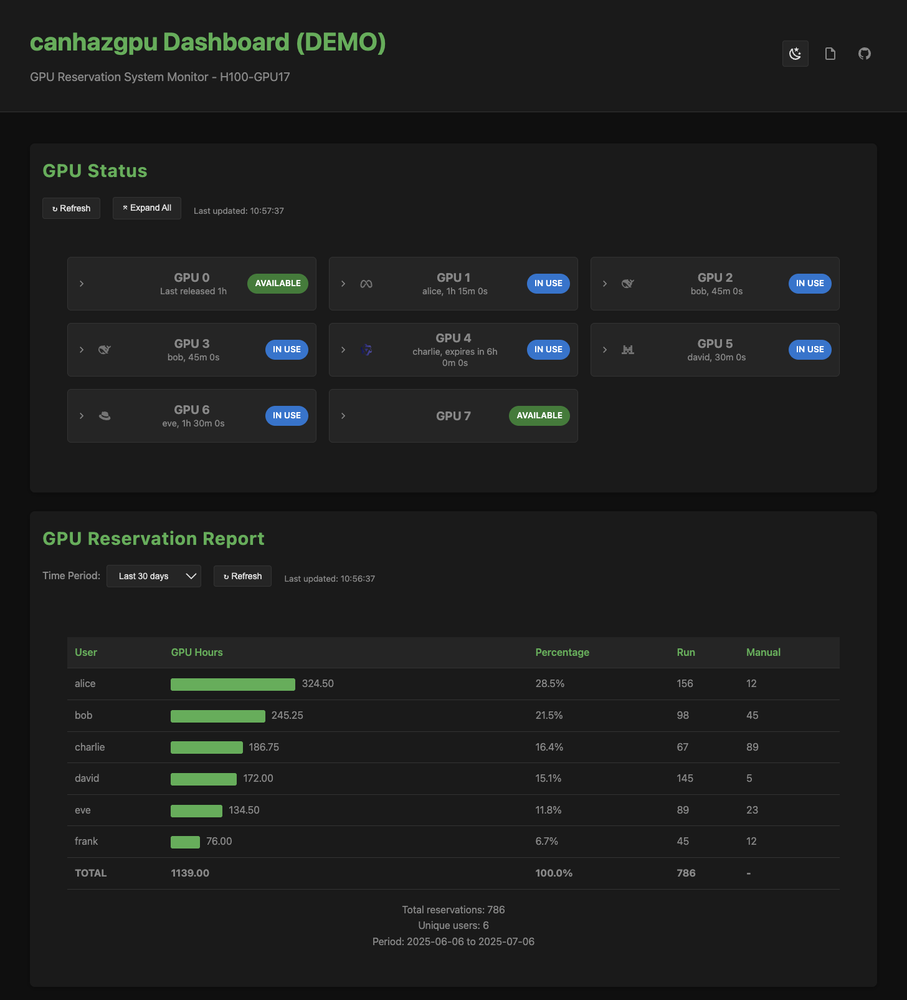

# Quick Start Guide

This guide will get you up and running with canhazgpu in just a few minutes.

## 1. Initialize the GPU Pool

First, tell canhazgpu how many GPUs are available on your system:

```bash
canhazgpu admin --gpus 8
```

!!! info "Finding GPU Count"
    Use `nvidia-smi` to see how many GPUs are available on your system.

If you need to change the GPU count later:

```bash
canhazgpu admin --gpus 4 --force
```

## 2. Check Status

View the current GPU allocation status:

```bash
canhazgpu status
```

Initially, all GPUs should show as `AVAILABLE`.

## 3. Reserve and Run a Job

Use the `run` command to reserve GPUs and execute a command:

```bash
# Reserve 1 GPU and run a Python script
canhazgpu run --gpus 1 -- python train.py

# Reserve specific GPUs by ID
canhazgpu run --gpu-ids 1,3 -- python train.py

# Reserve 2 GPUs for distributed training
canhazgpu run --gpus 2 -- python -m torch.distributed.launch train.py
```

The `run` command will:

- Reserve the requested number of GPUs
- Set `CUDA_VISIBLE_DEVICES` to the allocated GPU IDs
- Run your command
- Automatically release GPUs when the command finishes

## 4. Manual Reservations

Reserve GPUs without running a command immediately:

```bash
# Reserve 1 GPU for 8 hours (default)
canhazgpu reserve

# Reserve 2 GPUs for 4 hours
canhazgpu reserve --gpus 2 --duration 4h

# Reserve specific GPU IDs
canhazgpu reserve --gpu-ids 0,2 --duration 2h

# Reserve for different time periods
canhazgpu reserve --duration 30m    # 30 minutes
canhazgpu reserve --duration 2d     # 2 days
```

## 5. Release Manual Reservations

When you're done with manually reserved GPUs:

```bash
canhazgpu release
```

!!! note "Automatic vs Manual Release"
    - `run` command: GPUs are automatically released when the command ends
    - `reserve` command: GPUs must be manually released or will expire after the duration

## 6. Monitor Usage

Check the status regularly to see GPU usage:

```bash
canhazgpu status
```

Example output:
```
GPU  STATUS      USER      DURATION     TYPE    MODEL                    DETAILS                  VALIDATION
---  ------      ----      --------     ----    -----                    -------                  ----------
0    AVAILABLE   -         -            -       -                        free for 2h 30m 15s     1MB used
1    IN_USE      alice     0h 15m 30s   RUN     meta-llama/Llama-2-13b-chat-hf  heartbeat 0h 0m 5s ago   8452MB, 1 processes
2    UNRESERVED  user bob  -            -       mistralai/Mistral-7B-Instruct-v0.1        1024MB used by PID 12345 (python3)  -
3    IN_USE      charlie   1h 2m 15s    MANUAL  -                        expires in 3h 15m 45s   no usage detected
```

!!! info "Understanding the Output"
    The status shows [validated GPU usage](features-validation.md) and can detect [unreserved usage](features-unreserved.md). GPUs are allocated using the [LRU strategy](features-lru.md) for fair distribution.

## 7. Generate GPU Reservation Reports

View GPU reservation patterns over time:

```bash
# Last 30 days (default)
canhazgpu report

# Last 7 days
canhazgpu report --days 7

# Last 24 hours
canhazgpu report --days 1
```

## 8. Web Dashboard

For continuous monitoring, start the web dashboard:

```bash
# Start on default port 8080
canhazgpu web

# Start on custom port
canhazgpu web --port 3000
```

Then open http://localhost:8080 in your browser to see:
- Real-time GPU status
- Interactive reservation reports
- Visual allocation indicators



## Configuration

### Using Configuration Files

Create a configuration file to avoid specifying common options repeatedly:

```bash
# Create configuration file
cat > ~/.canhazgpu.yaml <<EOF
redis:
  host: localhost
  port: 6379
  db: 0
memory:
  threshold: 512
EOF

# Commands will now use these defaults
canhazgpu status  # Uses threshold of 512 MB
```

### Environment Variables

Set configuration via environment variables:

```bash
export CANHAZGPU_MEMORY_THRESHOLD=512
export CANHAZGPU_REDIS_HOST=redis.example.com

canhazgpu status  # Uses environment variables
```

### Custom Memory Threshold

Adjust when a GPU is considered "in use":

```bash
# Lower threshold - detect lighter GPU usage
canhazgpu status --memory-threshold 256

# Higher threshold - ignore small allocations  
canhazgpu run --memory-threshold 2048 --gpus 1 -- python train.py
```

## Common Patterns

### Long-Running Training
```bash
# Start a long training job
canhazgpu run --gpus 2 -- python train.py --epochs 100
```

### Interactive Development
```bash
# Reserve GPUs for development session
canhazgpu reserve --gpus 1 --duration 4h
# Note the GPU ID from output, e.g., "Reserved 1 GPU(s): [3]"

# Manually set CUDA_VISIBLE_DEVICES
export CUDA_VISIBLE_DEVICES=3

# Use the GPU in your development environment

# When done
canhazgpu release
```

### Jupyter Notebooks
```bash
# Reserve GPU for notebook session
canhazgpu reserve --gpus 1 --duration 2h
# Note the GPU ID from output, e.g., "Reserved 1 GPU(s): [2]"

# Set environment variable
export CUDA_VISIBLE_DEVICES=2

# Start Jupyter with the reserved GPU
jupyter notebook

# Release when done
canhazgpu release
```

## Troubleshooting

### "Not enough GPUs available"
Check the status to see if GPUs are in use:
```bash
canhazgpu status
```

If you see `IN USE WITHOUT RESERVATION`, someone is using GPUs without proper reservation.

### Redis Connection Issues
Verify Redis is running:
```bash
redis-cli ping
```

Should return `PONG`. If not, start Redis:
```bash
sudo systemctl start redis-server
```

### Permission Issues
If you get permission errors, ensure:
- Redis is accessible
- You have access to `/proc` filesystem
- nvidia-smi is available

For more detailed troubleshooting, see the [Troubleshooting Guide](admin-troubleshooting.md).

## Next Steps

- **[Configuration](configuration.md)** - Set up defaults and customize behavior
- **[Commands Overview](commands.md)** - Learn all available commands in detail
- **[Usage Patterns](usage-run.md)** - Advanced usage patterns and examples
- **[Installation](installation.md)** - Install dependencies and configure